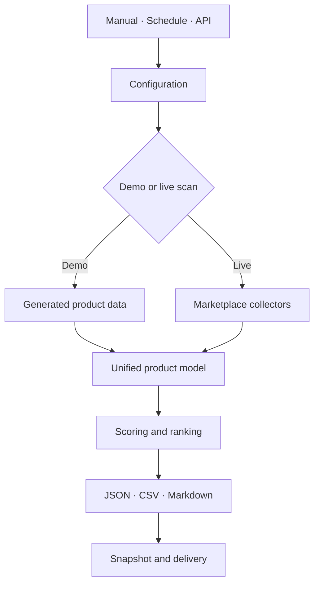

# MarketPulse — Multi-Marketplace Product Opportunity Radar

[Русская версия](README_RU.md) · [Architecture](docs/ARCHITECTURE.md) · [Setup](docs/SETUP.md) · [Data contracts](docs/DATA_CONTRACTS.md)

An n8n workflow that collects marketplace search results, converts different source formats into one product model, calculates product-opportunity scores, and prepares JSON, CSV, and Markdown reports.

## What the workflow does

- accepts manual, scheduled, and API-triggered scans;
- processes Wildberries, Ozon, and Yandex Market result formats;
- normalizes products, categories, prices, ratings, reviews, and seller data;
- compares current results with stored snapshots;
- calculates demand, momentum, competition, unit-economics, and data-quality components;
- applies commercial-risk penalties;
- ranks products and category opportunities;
- creates JSON, CSV, and Markdown output;
- optionally sends results to Telegram, Slack, or a warehouse endpoint;
- exposes authenticated endpoints for scans, results, health, and failure intake.

## Architecture



## Quick demo

1. Import [`workflows/marketpulse-marketplace-opportunity-radar.json`](workflows/marketpulse-marketplace-opportunity-radar.json) into n8n.
2. Open `Trigger · Run Demo`.
3. Execute the workflow.
4. Inspect the report, Markdown digest, CSV output, and staged snapshot nodes.

The demo branch generates fictional product data and does not call marketplace or delivery endpoints.

## Scoring model

| Component | Weight |
| --- | ---: |
| Demand | 36% |
| Momentum | 20% |
| Unit economics | 22% |
| Low competition | 14% |
| Data quality | 8% |

Risk penalties are applied after the weighted score. Thresholds and commercial assumptions are configured in `Config · Build Runtime Policy`.

## API endpoints

| Method | Path | Purpose |
| --- | --- | --- |
| `POST` | `/webhook/marketpulse-scan` | Start a scan |
| `GET` | `/webhook/marketpulse-opportunities` | Return the latest snapshot |
| `GET` | `/webhook/marketpulse-health` | Return workflow health information |
| `POST` | `/webhook/marketpulse-failure-intake` | Accept a failure event |

All webhook nodes use Header Auth. Add your own n8n credential after import.

## Configuration

Use [SETUP.md](docs/SETUP.md) to configure sources, query lists, scoring assumptions, delivery channels, and webhook authentication. Source response formats can change, so collector mappings should be checked before scheduled use.

## Repository structure

```text
workflows/       n8n workflow file
samples/         example requests and generated reports
docs/            architecture, setup, and data contracts
scripts/         local workflow checks
tests/           automated tests
```

## License

MIT — see [LICENSE](LICENSE).
