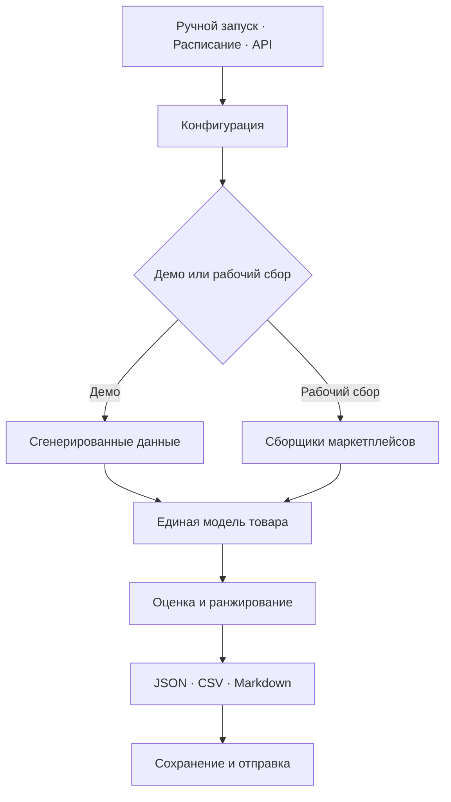

# MarketPulse — радар товарных возможностей на маркетплейсах

[English version](README.md) · [Архитектура](docs/ARCHITECTURE.md) · [Настройка](docs/SETUP.md) · [Структура данных](docs/DATA_CONTRACTS.md)

Workflow n8n для сбора результатов поиска на маркетплейсах, приведения разных форматов к единой модели товара, расчёта оценки возможностей и формирования отчётов в JSON, CSV и Markdown.

## Что делает workflow

- запускает сканирование вручную, по расписанию или через API;
- обрабатывает форматы Wildberries, Ozon и Яндекс Маркета;
- нормализует товары, категории, цены, рейтинги, отзывы и данные продавцов;
- сравнивает текущие результаты с сохранёнными снимками;
- рассчитывает спрос, динамику, конкуренцию, экономику и качество данных;
- применяет штрафы за коммерческие риски;
- ранжирует товары и категории;
- создаёт отчёты в JSON, CSV и Markdown;
- при необходимости отправляет результат в Telegram, Slack или внешнее хранилище;
- предоставляет защищённые endpoint для запуска, результатов и состояния системы.

## Архитектура



## Быстрый запуск

1. Импортируйте [`workflows/marketpulse-marketplace-opportunity-radar.json`](workflows/marketpulse-marketplace-opportunity-radar.json) в n8n.
2. Откройте `Trigger · Run Demo`.
3. Запустите workflow.
4. Посмотрите итоговый отчёт, Markdown-дайджест, CSV и сохранённый снимок.

Демонстрационная ветка использует вымышленные товары и не обращается к маркетплейсам или каналам отправки.

## Модель оценки

| Компонент | Вес |
| --- | ---: |
| Спрос | 36% |
| Динамика | 20% |
| Экономика | 22% |
| Низкая конкуренция | 14% |
| Качество данных | 8% |

После расчёта применяются штрафы за риски. Пороговые значения и коммерческие допущения задаются в ноде `Config · Build Runtime Policy`.

## API

| Метод | Путь | Назначение |
| --- | --- | --- |
| `POST` | `/webhook/marketpulse-scan` | Запуск сканирования |
| `GET` | `/webhook/marketpulse-opportunities` | Последний сохранённый результат |
| `GET` | `/webhook/marketpulse-health` | Состояние workflow |
| `POST` | `/webhook/marketpulse-failure-intake` | Приём сообщения об ошибке |

Все webhook-ноды используют Header Auth. После импорта добавьте собственный credential n8n.

## Настройка

В [SETUP.md](docs/SETUP.md) описаны источники, поисковые запросы, параметры расчёта, каналы отправки и защита webhook. Форматы ответов маркетплейсов могут меняться, поэтому перед запуском по расписанию нужно проверить преобразование данных.

## Структура репозитория

```text
workflows/       файл workflow n8n
samples/         примеры запросов и отчётов
docs/            архитектура, настройка и структура данных
scripts/         локальные технические проверки
tests/           автоматические тесты
```

## Лицензия

MIT — см. [LICENSE](LICENSE).
