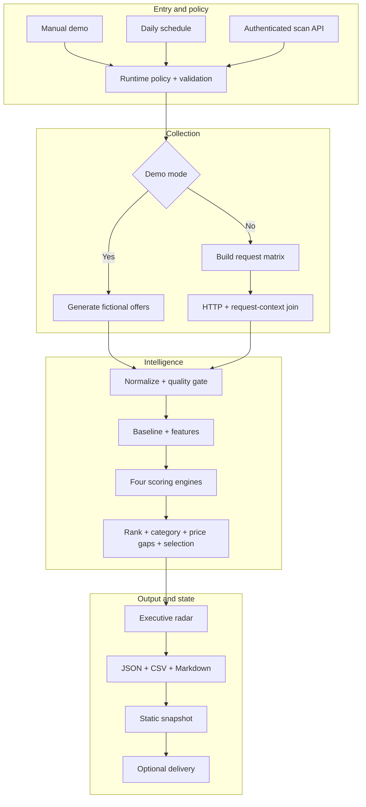
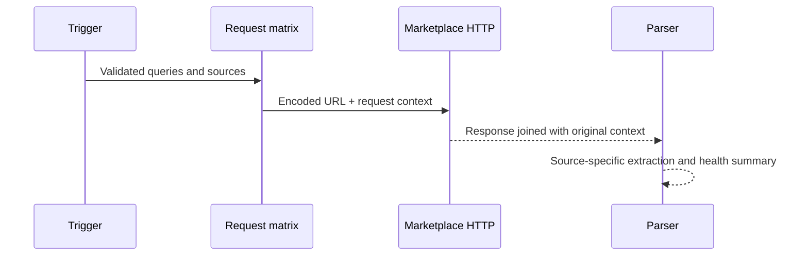

# Architecture

## System boundary

MarketPulse is one importable n8n workflow with four independent trigger surfaces. The manual trigger is a network-free demonstration. The schedule and on-demand scan can collect live storefront responses. Two read APIs expose the latest committed snapshot and its health, while a fourth protected webhook accepts failure events.

The workflow has 77 nodes: 10 canvas notes, 37 Code nodes, 13 Merge nodes, 4 HTTP Request nodes, 4 Webhook nodes, 3 Respond to Webhook nodes, 3 If nodes, 1 Manual Trigger, 1 Schedule Trigger, and 1 No Operation terminal.

## Processing topology

## Phase responsibilities

| Phase | Responsibility | Important invariant |
|---|---|---|
| Context | Normalize manual, scheduled, and API triggers | Downstream nodes receive the same envelope |
| Config | Build an allow-listed policy and validate weights/integrations | Delivery fails closed when runtime values are incomplete |
| Collection | Generate fictional data or make bounded requests | A caller cannot inject an arbitrary collection URL |
| Join | Reattach request context to each HTTP response | Parser always knows source, query, request ID, and timing |
| Normalize | Adapt three source shapes into `marketpulse.product.v1` | Marketplace-specific parsing stays isolated |
| Quality | Clean, validate, and deduplicate | Invalid products are counted and excluded before scoring |
| Feature | Attach a seven-day baseline and comparable signals | First live observation is explicitly marked synthetic |
| Score | Compute demand, momentum, competition, economics, and risk | Every component and penalty remains inspectable |
| Insight | Rank products and build decision-oriented slices | Price gaps are calculated within each query cluster |
| Export | Render the same report as JSON, CSV, and Markdown | Output formats share one executive report |
| State | Stage latest snapshot and bounded history | Manual executions do not persist static data |
| Delivery | Optionally post to three destinations | Disabled by default; responses are consolidated without losing the report |
| Observe | Expose freshness and accept failure events | Health output omits execution URLs and internal references |

## Live collection sequence

`Collect · Join Request Context + HTTP Response` is intentionally explicit. An HTTP node may emit a response-focused item, so relying on request fields to survive implicitly makes response attribution fragile. The positional join retains the original allow-listed request envelope and combines it with status, headers, body, or a continued error item.

## Scoring fan-out and join

The engineered product array fans out to four independent Code nodes:

1. Demand and momentum.
2. Competitive pressure.
3. Unit economics.
4. Risk and compliance.

Each branch returns a dictionary keyed by `marketplace:sku`. Position-based Merge nodes then assemble the dictionaries with the unchanged product base. This avoids multiplying product items at every scoring branch and keeps join behavior deterministic.

The opportunity score is:

\[
0.36D + 0.20M + 0.22E + 0.14(100-C) + 0.08Q - R
\]

where \(D\) is demand, \(M\) momentum, \(E\) economics, \(C\) competition, \(Q\) data completeness, and \(R\) the risk penalty. All values are bounded to 0–100 before the final clamp.

## State model

Workflow static data holds three bounded structures:

| Key | Contents | Bound |
|---|---|---:|
| `marketpulse_latest` | Latest executive report and exports | One snapshot |
| `marketpulse_runs` | Compact execution summaries | 30 runs |
| `marketpulse_product_state` | Latest live baseline by product key | 2,000 products |
| `marketpulse_errors` | Bounded failure events | 50 events |

Static data supports the included demo and a modest single-worker setup. For high-volume or concurrent execution, use a database or n8n Data Table.

## Trust boundaries

- Untrusted: webhook body, headers, marketplace responses, and failure-intake payloads.
- Trusted after validation: allow-listed source names, generated collection URLs, scoring policy, and runtime delivery destinations.
- Secret-bearing: Header Auth credentials and optional delivery runtime values. Configure these in n8n rather than in the workflow file.

## Failure behavior

- Non-2xx collection responses continue to the parser and appear in `request_log` and `source_health`.
- Network-level HTTP failures use regular-output continuation so other source items can still be evaluated.
- Invalid requests fail before collection.
- Delivery cannot be enabled with placeholder or non-HTTPS values.
- Delivery response consolidation retrieves the staged report explicitly if HTTP outputs contain only response fields.
- Read APIs return a clear `success: false` result until a production-triggered snapshot exists.
- Failure intake is an optional protected ingestion endpoint; it is not a substitute for a separately configured native n8n Error Workflow.
